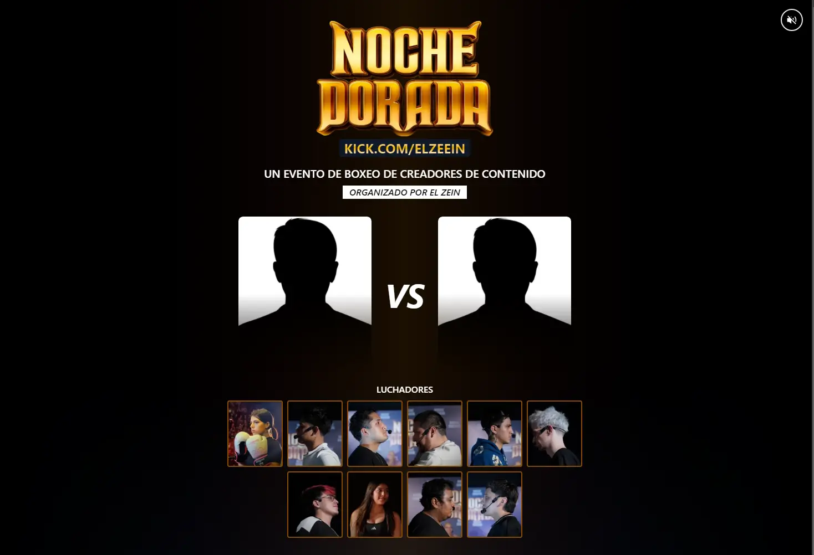

# Noche Dorada, La Velada del Zein

Es una página web no oficial dedicada al evento de boxeo de **El Zein**. Inspirado en las pantallas de selección de personajes de videojuegos clásicos como Tekken, Street Fighter y otros.

Este proyecto es completamente **open-source** y está abierto a la colaboración. Si estás interesado en mejorar o aportar nuevas características, ¡serás más que bienvenido!

```
PERÚ ES CLAVE
```

### 🏠️ Home



## Stack de tecnologías utilizadas

- [Astro](https://astro.build/)
- [Tailwind CSS](https://tailwindcss.com/)
- [Tailwind CSS Animated](https://www.tailwindcss-animated.com/)

## Comandos para iniciar en local

```
git clone (RUTA_DE_ESTE_REPOSITORIO)
```

```
cd /my-folder
```

```
npm install
```

```
npm run dev
```

## ¿Cómo colaborar con este proyecto?

- Haz un _fork_ del repositorio.
- Crea una nueva rama para tu feature o corrección.
- Realiza un _pull request_ con las modificaciones.
